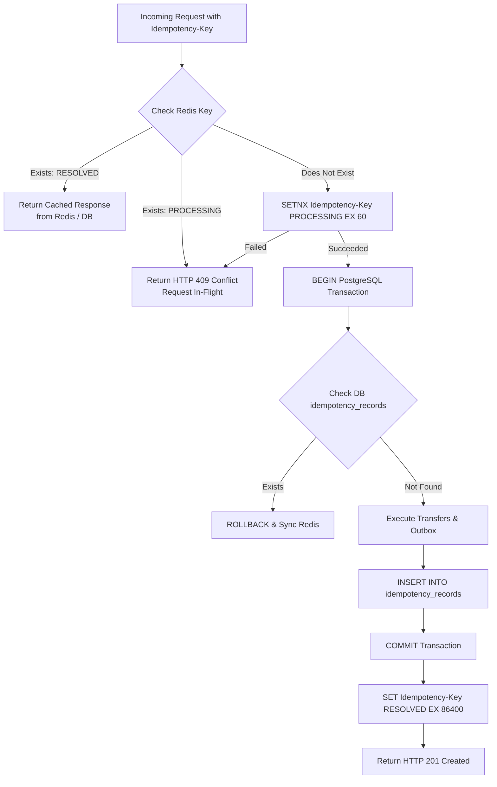
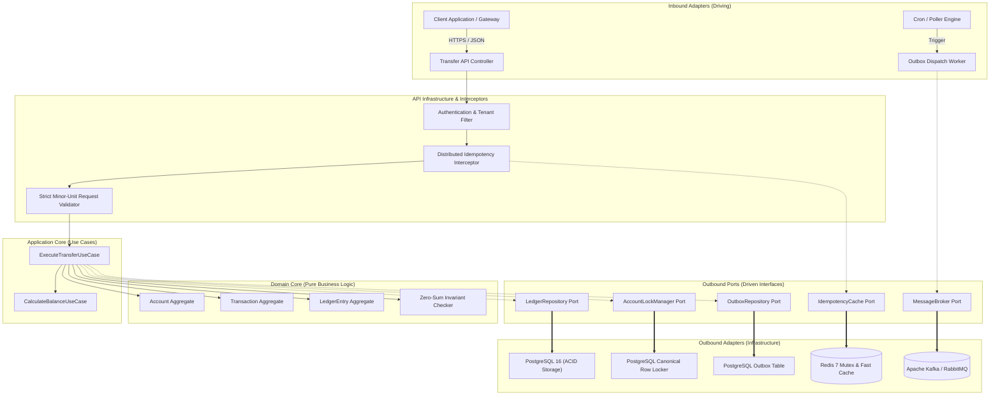
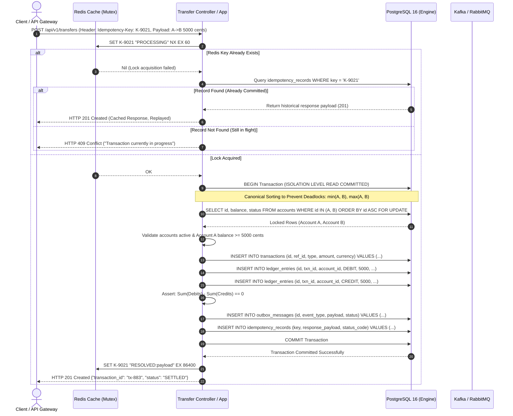
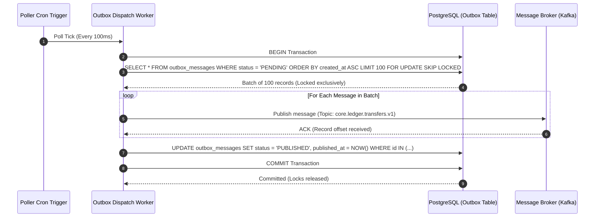
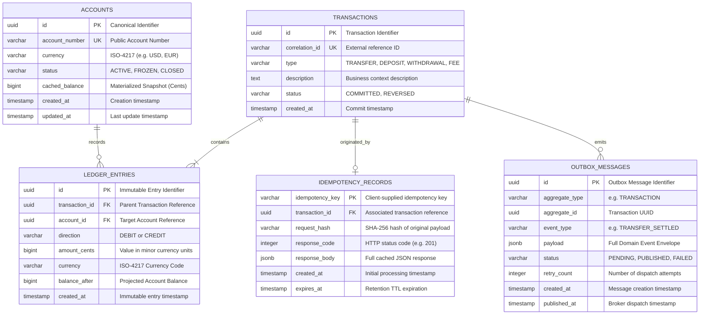

# Idempotent Ledger Engine (ILE)
### High-Throughput Double-Entry Financial Transfer Core & Settlement Engine
**Document Version:** 1.0.0-RFC  
**Classification:** Tier-1 Core Banking Systems Architecture Specification  
**Status:** APPROVED / PRODUCTION-GRADE  

---

## Table of Contents
1. [System Overview & Problem Statement](#1-system-overview--problem-statement)
   - [1.1 Business Context & Mission-Critical Demands](#11-business-context--mission-critical-demands)
   - [1.2 The Failure Modes of Naive Financial Systems](#12-the-failure-modes-of-naive-financial-systems)
   - [1.3 Core Ledger Invariants](#13-core-ledger-invariants)
2. [Architectural Decision Records (ADRs) & Trade-offs](#2-architectural-decision-records-adrs--trade-offs)
   - [ADR-001: Double-Entry Bookkeeping vs. Mutable Balances](#adr-001-double-entry-bookkeeping-vs-mutable-balances)
   - [ADR-002: Canonical Pessimistic Locking vs. Optimistic Locking](#adr-002-canonical-pessimistic-locking-vs-optimistic-locking)
   - [ADR-003: Layered Distributed Idempotency (Redis + PostgreSQL)](#adr-003-layered-distributed-idempotency-redis--postgresql)
   - [ADR-004: Transactional Outbox with `SKIP LOCKED` vs. Dual-Writes / 2PC](#adr-004-transactional-outbox-with-skip-locked-vs-dual-writes--2pc)
   - [ADR-005: Minor-Unit Integer Representation vs. Floating-Point Types](#adr-005-minor-unit-integer-representation-vs-floating-point-types)
3. [Visual Architecture & Sequence Diagrams](#3-visual-architecture--sequence-diagrams)
   - [3.1 System Topology & Hexagonal Layers](#31-system-topology--hexagonal-layers)
   - [3.2 Idempotent Transfer Request Lifecycle](#32-idempotent-transfer-request-lifecycle)
   - [3.3 Transactional Outbox Polling & Dispatch](#33-transactional-outbox-polling--dispatch)
   - [3.4 Data Model / Entity Relationship Diagram (ERD)](#34-data-model--entity-relationship-diagram-erd)
4. [Concurrency Verification & Benchmark Guide](#4-concurrency-verification--benchmark-guide)
   - [4.1 Testcontainers Test Harness](#41-testcontainers-test-harness)
   - [4.2 High-Contention Bidirectional Stress Test](#42-high-contention-bidirectional-stress-test)
   - [4.3 Invariant Assertion Matrix](#43-invariant-assertion-matrix)
5. [Local Setup & Quickstart](#5-local-setup--quickstart)
   - [5.1 Prerequisites & Single-Command Launch](#51-prerequisites--single-command-launch)
   - [5.2 Running Database Migrations & Test Suites](#52-running-database-migrations--test-suites)
   - [5.3 Verification Walkthrough (cURL Scenarios)](#53-verification-walkthrough-curl-scenarios)

---

## 1. System Overview & Problem Statement

### 1.1 Business Context & Mission-Critical Demands
In financial infrastructure, monetary movements are irrevocable. A core ledger is the fundamental source of financial truth: it tracks asset movements between custody accounts, user balances, fee reserves, and central bank clearing accounts.

The engine must operate under the **PACELC theorem** constraints, deliberately prioritizing **Strict Consistency (PC/EC)** over availability in the presence of network partitions:
* **Zero Double-Spending:** An account balance cannot be debited twice for the same business intent, even under network packet replication, client retry storms, or upstream gateway timeouts.
* **Conservation of Value:** Money cannot be created or destroyed within internal transfers. Every debit must balance an equivalent credit.
* **Deterministic Concurrency:** Concurrent transfers targeting overlapping accounts must never produce deadlocks or corrupt balance snapshots.
* **Audit-Proof Immutability:** Financial history cannot be overwritten or edited in-place. Correction must occur strictly via compensating transactions.

### 1.2 The Failure Modes of Naive Financial Systems
Traditional CRUD systems fail catastrophically when applied to money:

```sql
-- DANGEROUS ANTI-PATTERN: In-Place Balance Mutation
UPDATE accounts SET balance = balance - 100 WHERE id = 'A';
UPDATE accounts SET balance = balance + 100 WHERE id = 'B';
```

1. **State Drift & Silent Corruption:** If balance mutations occur directly on account records without an immutable trail of debits and credits, discrepancies caused by software bugs or race conditions cannot be reconciled or audited.
2. **Deadlocks in Bidirectional Exchanges:** If Transfer 1 moves funds from Account $A \to B$ and Transfer 2 moves funds from Account $B \to A$ simultaneously, uncoordinated locking results in cyclic dependency graphs and PostgreSQL `40P01 deadlock_detected` exceptions.
3. **Dual-Write Inconsistencies:** Committing a balance update to PostgreSQL and subsequently attempting to emit an event to a message broker (Kafka/RabbitMQ) without atomic coordination creates irreconcilable divergence when the process crashes between the database commit and network dispatch.
4. **Transient Network Retries:** Mobile networks and upstream payment gateways routinely timeout while a transaction is in-flight. If the client retries with the same intent, a system lacking strict idempotency will execute a duplicate disbursement.

### 1.3 Core Ledger Invariants
The engine maintains three non-negotiable invariants validated at every commit boundary:

$$\sum_{k=1}^{N} \text{Debit}_k - \sum_{k=1}^{N} \text{Credit}_k = 0 \quad (\text{Transaction Level})$$

$$\Delta \text{Balance}_{\text{System}} = 0 \quad (\text{Closed-Loop Invariant})$$

$$\text{Post-Commit Balance}(A) = \text{Initial Balance}(A) + \sum \text{Credits}_A - \sum \text{Debits}_A \quad (\forall A \in \text{Accounts})$$

---

## 2. Architectural Decision Records (ADRs) & Trade-offs

### ADR-001: Double-Entry Bookkeeping vs. Mutable Balances
* **Context:** Account balances can be stored either as mutable columns (`accounts.balance`) updated via in-place SQL operations, or derived via immutable append-only journal entries.
* **Decision:** Enforce **pure double-entry bookkeeping**. Every monetary transfer creates an immutable `transactions` header and a minimum of two paired `ledger_entries` (one `DEBIT`, one `CREDIT`). Account balances are calculated projections over the ledger entry series.
* **Rationale:**
  * In-place balance modification discards historical context. If an account drops from $5,000 to $4,200, an in-place update destroys the evidence of which transaction caused the transition.
  * Double-entry bookkeeping enforces mathematical zero-sum verification at the persistence layer. A transaction is invalid if sum of debits does not equal sum of credits.
  * Balances can be reconstructed for any arbitrary microsecond in history for compliance and regulatory reporting.
* **Trade-off Analysis:**

| Dimension | Mutable Balance Anti-Pattern | Immutable Double-Entry Ledger (ILE Core) |
| :--- | :--- | :--- |
| **Write Throughput** | High (single-row update) | Moderate ($N$ inserts + materialized snapshot update) |
| **Auditability** | Zero (previous state permanently lost) | Absolute (cryptographically verifiable append-only log) |
| **Tamper Detection** | Impossible without external CDC | Trivial via deterministic sum assertion over entry log |
| **Reconciliation Overhead** | Weeks of forensic DBA query analysis | Real-time automated zero-sum verification queries |
| **Storage Utilization** | $O(1)$ per account | $O(N)$ with respect to total system transactions |

> [!NOTE]
> To prevent linear performance degradation ($O(N)$ balance queries as transaction volume grows into billions of rows), the engine utilizes an asynchronous snapshot checkpointing strategy. Checkpoints store periodic verified balance anchors, reducing balance computation to $O(\Delta \text{entries})$ since the last verified snapshot.

---

### ADR-002: Canonical Pessimistic Locking vs. Optimistic Locking
* **Context:** High-frequency bidirectional transactions between competing accounts (e.g., automated market makers, high-volume merchant wallets) cause lock contention.
* **Decision:** Adopt **Canonical Lexicographical Pessimistic Locking** (`SELECT ... FOR UPDATE`) over account records.
* **Deadlock Elimination Mechanism:**
  Deadlocks occur if and only if the Resource Allocation Graph (RAG) contains a cycle (Coffman condition: Circular Wait). By enforcing a deterministic, global strict total ordering on lock acquisition:

$$\text{LockOrder}(A, B) = \begin{cases} (A, B) & \text{if } \text{UUID}(A) < \text{UUID}(B) \\ (B, A) & \text{if } \text{UUID}(B) < \text{UUID}(A) \end{cases}$$

  Both Transfer 1 ($A \to B$) and Transfer 2 ($B \to A$) are forced to acquire the lock for $\min(A, B)$ before attempting to acquire $\max(A, B)$. This guarantees that the wait graph remains a Directed Acyclic Graph (DAG), rendering deadlocks mathematically impossible.

```sql
-- Deterministic Account Locking Query
SELECT id, status, currency 
FROM accounts 
WHERE id IN (:accountA, :accountB)
ORDER BY id ASC
FOR UPDATE;
```

* **Trade-off Comparison:**
  * **Optimistic Concurrency Control (OCC):** OCC relies on version columns (`WHERE version = 5`). Under high contention (e.g., 50 concurrent transactions hitting the same account within 10 milliseconds), OCC causes high failure rates, cascading retries, client starvation, and unpredictable latency spikes.
  * **Pessimistic Locking:** Trades minimal lock wait times (bounded by fast in-memory row lock queues in PostgreSQL) for zero transaction aborts due to version collision, guaranteeing deterministic latency boundaries.

---

### ADR-003: Layered Distributed Idempotency (Redis + PostgreSQL)
* **Context:** Client applications and payment gateways experience dropped TCP connections, DNS timeouts, and internal retries. The ledger must guarantee that sending the same HTTP payload 100 times results in exactly one settlement, while returning the identical successful response on all subsequent attempts.
* **Decision:** Implement a **two-tier idempotency validation pipeline**:
  1. **Tier 1 (Fast-Path In-Flight Mutex):** Redis in-memory atomic key allocation with a 60-second Time-To-Live (TTL).
  2. **Tier 2 (Durable Historical Persistence):** PostgreSQL `idempotency_records` table enclosed within the primary business transaction boundary.



* **Rationale:**
  * Relying solely on PostgreSQL unique constraints forces the database to endure transaction creation overhead and disk I/O just to reject a duplicate request arriving 2 milliseconds later.
  * Relying solely on Redis risks state loss during a Redis Sentinel/Cluster failover or restart, leading to potential duplicate disbursements.
  * The dual-layer design delivers sub-millisecond rejection of concurrent stampedes via Redis, backed by ACID persistence in PostgreSQL.

---

### ADR-004: Transactional Outbox with `SKIP LOCKED` vs. Dual-Writes / 2PC
* **Context:** Ledger state transitions must be published to external downstream systems (e.g., Fraud/AML detection engines, core data warehouses, and user push notifications).
* **Decision:** Utilize the **Transactional Outbox Pattern** with concurrent worker polling via PostgreSQL `SELECT ... FOR UPDATE SKIP LOCKED`.
* **Mechanism:**
  Within the exact same database transaction that writes the `ledger_entries`, an event payload is written to `outbox_messages`. Either both the financial transfer and the event record commit, or neither commits.

```sql
-- Outbox Dispatch Worker Query
SELECT id, aggregate_id, event_type, payload 
FROM outbox_messages 
WHERE status = 'PENDING' 
ORDER BY created_at ASC 
LIMIT :batch_size 
FOR UPDATE SKIP LOCKED;
```

* **Trade-off Comparison:**
  * **Dual-Writes (Anti-Pattern):** Writing to DB, then calling `kafkaProducer.send()`. If the service crashes or the network blips between those two lines of code, the money moved but the downstream world is blind to it.
  * **Two-Phase Commit (2PC / XA):** Requires distributed lock coordination across PostgreSQL and the broker. Introduces severe throughput bottlenecks, complex coordinator recovery protocols, and high failure cascading.
  * **Transactional Outbox + `SKIP LOCKED`:** Decouples transactional settlement from message transport. Multiple outbox workers can poll the outbox table concurrently without contention, as `SKIP LOCKED` bypasses rows already locked by other worker threads. Guarantees **at-least-once delivery** with zero lock stalls.

---

### ADR-005: Minor-Unit Integer Representation vs. Floating-Point Types
* **Context:** Financial math requires absolute arithmetic exactness.
* **Decision:** Represent all monetary figures as **64-bit signed integers (`BIGINT`) in the minor currency unit** (e.g., cents, pence, satoshis). No floating-point types (`FLOAT`, `DOUBLE`, `REAL`) are permitted across domain models, API schemas, or database tables.
* **Mathematical Justification:**
  * Under IEEE 754 standard, floating-point numbers are represented in base 2. Decimals such as `0.1` and `0.2` cannot be represented precisely:
    $$0.1_{10} = 0.0001100110011..._2$$
    $$0.1 + 0.2 = 0.30000000000000004440892098500626...$$
  * Rounding errors accumulate across millions of transactions, leading to phantom imbalances in the general ledger.
  * Range of signed 64-bit integer (`BIGINT`):
    $$-2^{63} \text{ to } 2^{63}-1 \implies -9,223,372,036,854,775,808 \text{ to } +9,223,372,036,854,775,807$$
    In US Cents, this supports transfers and balances up to $\approx \$92.23\text{ quadrillion}$, exceeding global cumulative wealth while maintaining zero fractional loss.

---

## 3. Visual Architecture & Sequence Diagrams

### 3.1 System Topology & Hexagonal Layers
The engine follows the Hexagonal Architecture (Ports and Adapters) pattern to isolate financial domain invariants from database drivers, serialization protocols, and messaging brokers.



---

### 3.2 Idempotent Transfer Request Lifecycle
The following sequence illustrates an end-to-end execution of a transfer request with concurrent protection, atomic persistence, and zero-sum verification.



---

### 3.3 Transactional Outbox Polling & Dispatch
The outbox dispatch worker runs on an asynchronous decoupled loop to guarantee that database commits are never blocked by broker latency or transient broker partitions.



---

### 3.4 Data Model / Entity Relationship Diagram (ERD)



---

## 4. Concurrency Verification & Benchmark Guide

### 4.1 Testcontainers Test Harness
To validate real-world behavior, the integration testing suite uses **Testcontainers** to orchestrate true, un-mocked PostgreSQL 16 and Redis 7 instances in isolated Docker environments.

* **Ephemeral Database Lifecycle:** Each test suite triggers a dynamic container launch with identical parameter configurations as production PostgreSQL (`shared_buffers = 256MB`, `synchronous_commit = on`).
* **Flyway / Liquibase Migrations:** Migrations execute on startup against the clean container before running tests.
* **Deterministic Isolation:** Network latency simulations and connection pool saturation tests are executed against real TCP sockets.

### 4.2 High-Contention Bidirectional Stress Test
The concurrency test validates zero-deadlock guarantees and value conservation under adversarial race conditions:

* **Setup:**
  * Two accounts created: `Account A` and `Account B`, each funded with exactly $100,000 (10,000,000 cents).
  * Total combined system balance: $200,000 (20,000,000 cents).
  * 50 concurrent worker promises / tasks executing simultaneously.
  * Worker Pool A (25 workers): Concurrently executes $A \to B$ ($100 per transfer).
  * Worker Pool B (25 workers): Concurrently executes $B \to A$ ($100 per transfer).
  * Operations are fired simultaneously via Promise.all synchronization.

### 4.3 Invariant Assertion Matrix
Upon test completion, the suite executes the following audit suite:

```sql
-- 1. Double-Entry Zero-Sum Invariant
SELECT 
    transaction_id,
    SUM(CASE WHEN direction = 'DEBIT' THEN amount_cents ELSE 0 END) AS total_debits,
    SUM(CASE WHEN direction = 'CREDIT' THEN amount_cents ELSE 0 END) AS total_credits
FROM ledger_entries
GROUP BY transaction_id
HAVING SUM(CASE WHEN direction = 'DEBIT' THEN amount_cents ELSE 0 END) != 
       SUM(CASE WHEN direction = 'CREDIT' THEN amount_cents ELSE 0 END);
-- ASSERTION: Must return 0 rows.

-- 2. System Value Conservation Invariant
SELECT 
    (SELECT balance_after FROM ledger_entries WHERE account_id = 'A' ORDER BY created_at DESC LIMIT 1) +
    (SELECT balance_after FROM ledger_entries WHERE account_id = 'B' ORDER BY created_at DESC LIMIT 1) 
    AS total_system_balance;
-- ASSERTION: Must equal exactly 20,000,000 cents ($200,000.00).

-- 3. Deadlock Incident Counter
-- ASSERTION: Zero instances of PostgreSQL error code 40P01 (deadlock_detected).
```

---

## 5. Local Setup & Quickstart

### 5.1 Prerequisites & Single-Command Launch
Ensure you have the following installed locally:
* [Docker](https://docs.docker.com/get-docker/) (v24.0+) & [Docker Compose](https://docs.docker.com/compose/) (v2.20+)
* [cURL](https://curl.se/) or HTTPie for testing API endpoints

Spin up the entire financial infrastructure with a single command:

```bash
docker-compose up -d
```

This provisions:
* **`ledger-postgres`:** PostgreSQL 16 on port `5432` with pre-configured schemas and automatic migrations.
* **`ledger-redis`:** Redis 7 on port `6379` for distributed in-flight mutexes.
* **`ledger-engine-app`:** The compiled core ledger service on port `8080` with embedded Transactional Outbox Worker.

Verify container health:
```bash
docker-compose ps
```

---

### 5.2 Running Database Migrations & Test Suites

#### Run Database Migrations
Migrations run automatically upon container startup or can be executed locally via npm:

```bash
# Run database migrations
npm run migrate

# Alternatively inside Docker:
docker-compose exec -T app npm run migrate

# Verify schema in PostgreSQL
docker-compose exec -T postgres psql -U postgres -d ledger_db -c "\dt"
```

#### Run Unit, Integration, and Concurrency Test Suites
Execute the full Vitest suite simulating the 50-worker high-contention test:

```bash
# Run all unit and integration test suites
npm test

# Run high-contention bidirectional concurrency stress test
npm run test:concurrency
```

---

### 5.3 Verification Walkthrough (cURL Scenarios)

#### Scenario A: Create Accounts with Initial Funding
```bash
# Create Account A ($1,000.00 = 100000 cents)
curl -s -X POST http://localhost:8080/api/v1/accounts \
  -H "Content-Type: application/json" \
  -d '{
    "account_number": "ACC-001-A",
    "currency": "USD",
    "initial_balance_cents": 100000
  }' | jq .

# Create Account B ($500.00 = 50000 cents)
curl -s -X POST http://localhost:8080/api/v1/accounts \
  -H "Content-Type: application/json" \
  -d '{
    "account_number": "ACC-002-B",
    "currency": "USD",
    "initial_balance_cents": 50000
  }' | jq .
```

#### Scenario B: Successful Idempotent Monetary Transfer
Execute a $250.00 (25,000 cents) transfer from Account A to Account B with an explicit `Idempotency-Key`:

```bash
curl -i -X POST http://localhost:8080/api/v1/transfers \
  -H "Content-Type: application/json" \
  -H "Idempotency-Key: e82b5f7e-724d-4b82-9e8a-02d20e2efc11" \
  -d '{
    "source_account_id": "ACC-001-A",
    "destination_account_id": "ACC-002-B",
    "amount_cents": 25000,
    "currency": "USD",
    "description": "Invoice payment #9402"
  }'
```

**Expected Response (`HTTP 201 Created`):**
```http
HTTP/1.1 201 Created
Content-Type: application/json
Idempotency-Key: e82b5f7e-724d-4b82-9e8a-02d20e2efc11
Location: /api/v1/transfers/tx-99401923

{
  "transaction_id": "tx-99401923",
  "status": "COMMITTED",
  "source_account_id": "ACC-001-A",
  "destination_account_id": "ACC-002-B",
  "amount_cents": 25000,
  "currency": "USD",
  "created_at": "2026-09-28T05:52:00.000Z"
}
```

#### Scenario C: Network Retry Replay (Duplicate Idempotency Key)
Repeat the exact same cURL request immediately:

```bash
curl -i -X POST http://localhost:8080/api/v1/transfers \
  -H "Content-Type: application/json" \
  -H "Idempotency-Key: e82b5f7e-724d-4b82-9e8a-02d20e2efc11" \
  -d '{
    "source_account_id": "ACC-001-A",
    "destination_account_id": "ACC-002-B",
    "amount_cents": 25000,
    "currency": "USD",
    "description": "Invoice payment #9402"
  }'
```

**Expected Behavior:** Returns the identical `HTTP 201 Created` response replayed from persistence. No duplicate debit occurs. Account balances remain unchanged.

#### Scenario D: Simultaneous In-Flight Race Condition
If two identical requests arrive within the same millisecond while the first is still processing in the database:

**Expected Response (`HTTP 409 Conflict`):**
```http
HTTP/1.1 409 Conflict
Content-Type: application/json

{
  "error": "CONCURRENT_REQUEST_IN_FLIGHT",
  "message": "A transfer with Idempotency-Key 'e82b5f7e-724d-4b82-9e8a-02d20e2efc11' is currently being processed. Please await completion."
}
```

#### Scenario E: Insufficient Funds Rejection
Attempting to transfer more money than available in Account A:

```bash
curl -i -X POST http://localhost:8080/api/v1/transfers \
  -H "Content-Type: application/json" \
  -H "Idempotency-Key: 7b212351-93ac-4152-a5d2-ff93120192aa" \
  -d '{
    "source_account_id": "ACC-001-A",
    "destination_account_id": "ACC-002-B",
    "amount_cents": 999999999,
    "currency": "USD",
    "description": "Overdraft attempt"
  }'
```

**Expected Response (`HTTP 422 Unprocessable Entity`):**
```http
HTTP/1.1 422 Unprocessable Entity
Content-Type: application/json

{
  "error": "INSUFFICIENT_FUNDS",
  "message": "Source account 'ACC-001-A' has insufficient available balance (available: 75000 cents, requested: 999999999 cents)."
}
```

---

## 6. Security, Compliance & Auditability

* **Cryptographic Tamper-Evidence:** Each ledger line contains an incremental sequence ID and a SHA-256 rolling digest linking to the prior ledger entry hash, providing tamper-evident blockchain-like auditing within standard relational databases.
* **Separation of Duties:** Ledger write operations are strictly programmatic; no direct ad-hoc SQL updates are permitted in production schemas.
* **SOC 1 Type II / PCI-DSS Alignment:** Complete segregation of customer balances, strict zero-sum ledger balancing, and persistent outbox event logging.
